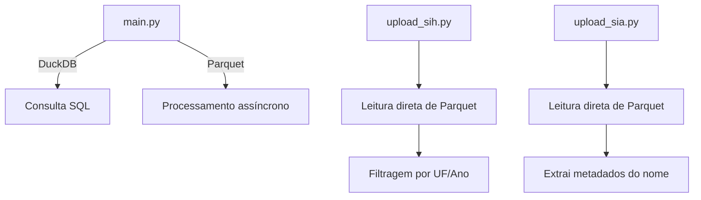

# Análise Comparativa dos Processos de ETL

## 1. Estrutura Geral
| Componente       | main.py                          | upload_sih.py                     | upload_sia.py                     |
|-------------------|-----------------------------------|------------------------------------|------------------------------------|
| Tipo              | API FastAPI com tasks assíncronas | Script autônomo                   | Script autônomo                   |
| Arquitetura       | Microsserviço com workers         | Processamento em lote              | Processamento em lote             |
| Paralelismo       | ThreadPoolExecutor                | Processamento sequencial           | Processamento sequencial           |
| Monitoramento     | Recursos em tempo real            | Logs básicos                       | Logs básicos                      |

## 2. Fluxo de Processamento
### 2.1 Captura de Dados

### 2.2 Transformação
| Característica     | main.py                          | upload_sih.py                     | upload_sia.py                     |
|--------------------|----------------------------------|------------------------------------|------------------------------------|
| Validação Schema   | Estrita com GRUPOS_INFO          | Colunas fixas por grupo            | Mapeamento dinâmico de tipos       |
| Conversão Tipos    | Automática por dtype             | Manual por coluna                  | Mapeamento pré-definido           |
| Tratamento Nulos   | pd.NA com substituição           | Preenchimento com strings vazias   | Conversão explícita para NULL     |
| Normalização       | Lowercase e ordenação            | Ajuste de ordem das colunas         | Adição de metadados (UF/log)       |

## 3. Carregamento
| Aspecto           | main.py                          | upload_sih.py                     | upload_sia.py                     |
|--------------------|----------------------------------|------------------------------------|------------------------------------|
| Método            | COPY via SQLAlchemy              | COPY direto com psycopg2           | COPY direto com psycopg2          |
| Transações        | Commit por lote com rollback     | Commit automático                  | Commit por lote                   |
| Controle de Carga | PriorityQueue com semáforos      | Processamento sequencial           | Processamento sequencial           |
| Tamanho Lote      | Dinâmico (baseado em memória)    | Fixo (10,000 registros)            | Fixo (10,000 registros)            |

## 4. Gestão de Erros
| Mecanismo         | main.py                          | upload_sih.py                     | upload_sia.py                     |
|--------------------|----------------------------------|------------------------------------|------------------------------------|
| Validação Dados    | Schema validation do Pydantic    | Checagem de colunas faltantes      | Conversão tipo segura             |
| Tratamento Exceções| Global + por task                | Try/except por arquivo             | Try/except por lote               |
| Recuperação        | Checkpoint via id_log            | Reinício manual                    | Reinício manual                   |
| Logs              | Estruturados com recursos         | Detalhado por arquivo              | Detalhado por arquivo             |

## 5. Gestão de Recursos
| Recurso           | main.py                          | upload_sih.py                     | upload_sia.py                     |
|--------------------|----------------------------------|------------------------------------|------------------------------------|
| Memória           | GC ativo + limites dinâmicos     | Monitoramento básico               | Monitoramento básico              |
| CPU               | Throttling automático            | Sem controle                       | Sem controle                      |
| Conexões DB       | Pool gerenciado (10-20)           | Conexão única                       | Conexão única                      |
| Paralelismo       | 4 workers fixos                  | Sequencial                         | Sequencial                         |

## 6. Metadados e Rastreabilidade
| Elemento          | main.py                          | upload_sih.py                     | upload_sia.py                     |
|--------------------|----------------------------------|------------------------------------|------------------------------------|
| Identificação     | id_log único por registro        | id_log baseado em nome de arquivo  | id_log com UF e timestamp          |
| Auditoria         | Logs de recurso detalhados       | Logs de processo por arquivo       | Logs de processo por arquivo       |
| Controle Versão   | Hash de arquivos processados     | Nome de arquivo                    | Nome de arquivo + UF               |

## 7. Pontos Fortes e Fracos
### main.py
**✅ Vantagens:**
- Arquitetura escalável para grandes volumes
- Controle fino de recursos
- Validação robusta de dados

**❌ Desvantagens:**
- Complexidade de implementação
- Overhead de dependências

### upload_sih/sia.py
**✅ Vantagens:**
- Simplicidade de execução
- Fácil adaptação para diferentes estruturas
- Baixo consumo de recursos

**❌ Desvantagens:**
- Limitado a processamento sequencial
- Controle de erro básico
- Dificuldade de escalonamento

## 8. Recomendações de Melhoria
1. **Unificação de Logs:** Adotar formato estruturado único (JSON)
2. **Controle de Fluxo:** Implementar circuit breaker nos scripts
3. **Cache de Schemas:** Criar repositório centralizado de metadados
4. **Load Balancing:** Distribuição dinâmica de tarefas entre workers
5. **Monitoramento Unificado:** Integração com Prometheus/Grafana
