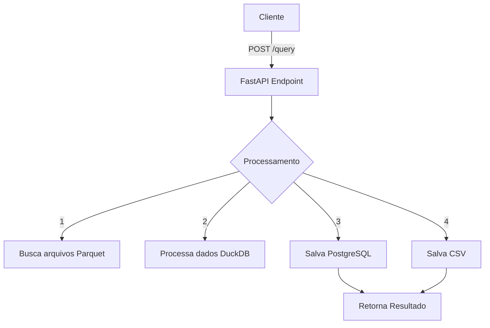
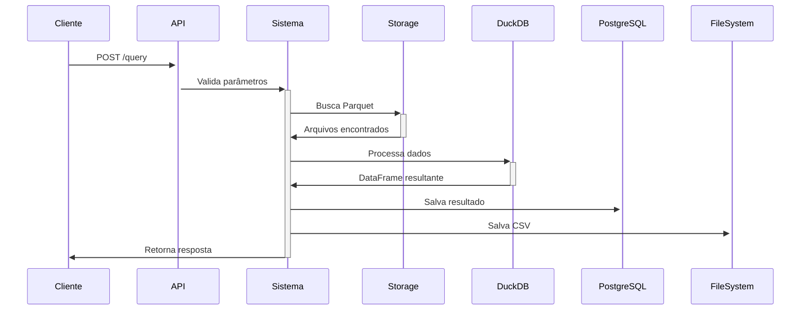

# Análise Técnica do main.py

## 1. Visão Geral do Sistema

O arquivo `main.py` implementa uma API REST usando FastAPI para consultar e processar dados do DataSUS. O sistema permite:

- Consultar dados de diferentes bases (SIH, SIA, CNES)
- Filtrar por grupos específicos de dados
- Agrupar resultados por campos selecionados
- Salvar resultados em PostgreSQL e CSV

## 2. Principais Componentes

### 2.1 Validação de Parâmetros (QueryParams)
- Valida base de dados (SIH, SIA, CNES)
- Valida grupos de dados
- Valida formato de competência (MM/YYYY)

### 2.2 Processamento de Arquivos
1. **get_parquet_files()**
   - Busca arquivos por UF/competência
   - Retorna lista de caminhos

2. **process_parquet_files()**
   - Usa DuckDB para query
   - Filtra por CNES
   - Agrupa por campos especificados

3. **save_results()**
   - Salva em PostgreSQL
   - Salva em CSV se < 10M registros

## 3. Fluxo de Dados

## 4. Análise de Estruturas

### 4.1 Mapeamentos
- `grupos_dict`: Mapeamento descritivo dos grupos
- `CAMPOS_CNES`: Mapeamento colunas CNES
- `GRUPOS_INFO_SIA/SIH`: Esquemas das tabelas

### 4.2 Configurações
- Logging: Console + Arquivo
- Banco de dados: PostgreSQL
- CORS: Habilitado para todas origens

## 5. Pontos de Atenção

1. **Performance**
   - Processamento arquivo por arquivo
   - Concatenação de todos resultados em memória

2. **Resiliência**
   - Tratamento de erros por arquivo
   - Validação de conexão DB

3. **Limitações**
   - Sem paginação de resultados
   - Sem cache de consultas
   - Autenticação removida temporariamente