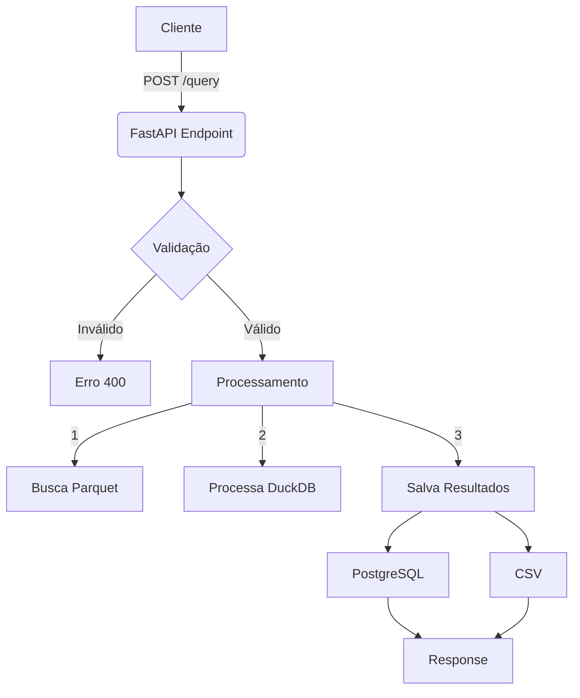
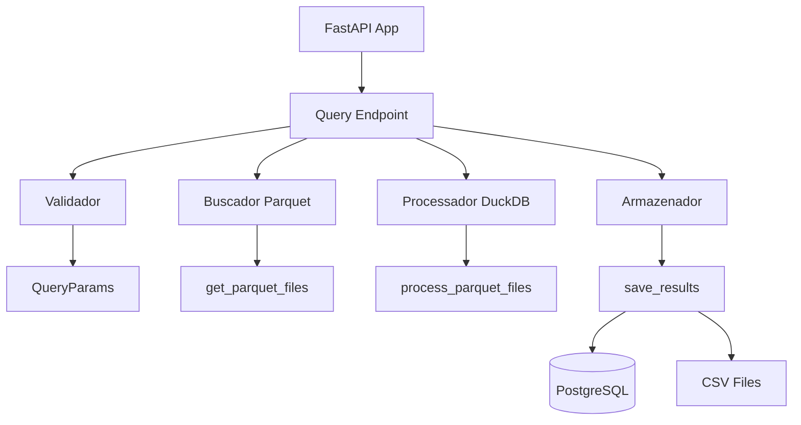
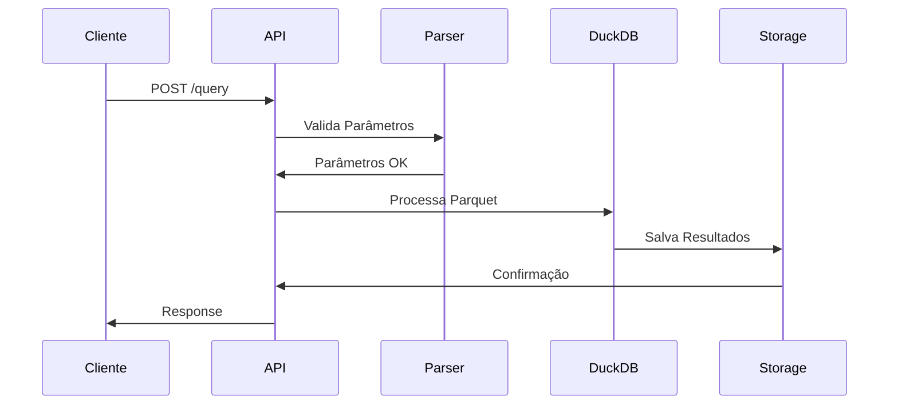

# Análise do Processo DataSUS API

## 1. Diagrama de Fluxo Principal



## 2. Diagrama de Componentes



## 3. Fluxo de Dados



## 4. Análise Técnica

### 4.1 Componentes Principais

1. **Validação de Entrada**
   - `QueryParams`: Classe Pydantic para validação
   - Validações: base, grupo, competências
   - Campos obrigatórios e opcionais

2. **Busca de Arquivos**
   - `get_parquet_files()`: Localiza arquivos por UF/competência
   - Padrão de nomenclatura: `{GRUPO}{UF}{ANO}{MES}.parquet`
   - Logging de arquivos encontrados

3. **Processamento**
   - `process_parquet_files()`: Processa via DuckDB
   - Filtragem por CNES
   - Agrupamento dinâmico
   - Concatenação de resultados

4. **Armazenamento**
   - `save_results()`: Salva resultados
   - PostgreSQL: Principal
   - CSV: Backup se < 10M registros

### 4.2 Fluxo de Execução

1. **Recebimento da Requisição**
   ```python
   @app.post("/query")
   async def query_data(params: QueryParams)
   ```

2. **Validação**
   - Base de dados (SIH/SIA/CNES)
   - Grupo de dados
   - Formato de competência
   - Lista de CNES

3. **Processamento**
   - Busca arquivos Parquet
   - Filtra por critérios
   - Agrupa resultados
   - Salva dados

4. **Resposta**
   - Status
   - Total de registros
   - Nome da tabela
   - Dados processados

### 4.3 Pontos de Atenção

1. **Performance**
   - Processamento sequencial
   - Uso de memória na concatenação
   - Tamanho dos arquivos Parquet

2. **Segurança**
   - CORS aberto
   - Autenticação removida
   - Controle de acesso básico

3. **Manutenção**
   - Logging detalhado
   - Tratamento de erros
   - Validações consistentes