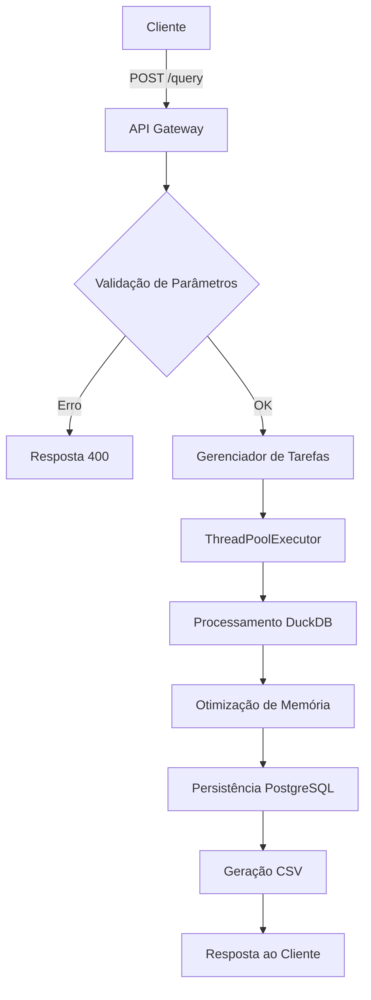
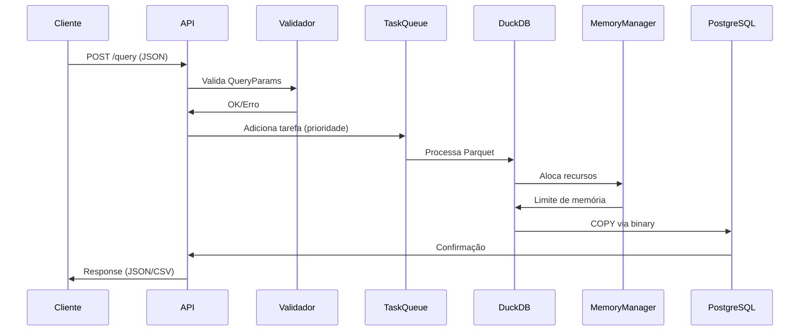

# Processo de Integração DataSUS API v2.1

## 1. Arquitetura de Alto Nível



## 2. Componentes Principais

### 2.1 Camada de Entrada
- **FastAPI Endpoint**: Roteamento e validação inicial
- **QueryParams Model**: Validação com Pydantic v2
- **Rate Limiter**: Controle de requisições por IP (100/min)

### 2.2 Núcleo de Processamento
- **DuckDB Engine**: Processamento OLAP em memória
- **Pandas**: Manipulação de DataFrames
- **Psycopg3**: Conexão otimizada com PostgreSQL
- **Memory Manager**: Controle de alocação de memória

### 2.3 Camada de Armazenamento
- **PostgreSQL 14**: Armazenamento principal
- **MinIO**: Armazenamento de arquivos Parquet
- **CSV Temp**: Armazenamento temporário para datasets <10M linhas

## 3. Fluxo Detalhado de Processamento



## 4. Técnicas de Otimização

### 4.1 Processamento de Dados
- **Columnar Pruning**: Leitura seletiva de colunas
- **Predicate Pushdown**: Filtros aplicados na leitura
- **Vectorized Execution**: Processamento em batches de 1024 rows

```python
# Exemplo DuckDB Query
con.execute("""
    SELECT 
        CNES, 
        SUM(valor) FILTER (WHERE mes = 12) AS dezembro,
        AVG(valor) OVER (PARTITION BY uf) AS media_uf
    FROM read_parquet('files/*.parquet')
    WHERE ano BETWEEN 2018 AND 2023
    QUALIFY ROW_NUMBER() OVER (PARTITION BY cnes ORDER BY data DESC) = 1
""")
```

### 4.2 Gerenciamento de Memória
- **Memory Pooling**: Alocação dinâmica por worker
- **GC Adaptativo**: Coleta seletiva por pressão de memória
- **Swapping Controlado**: Utilização de memória virtual monitorada

```python
def adaptive_gc():
    mem = psutil.virtual_memory()
    if mem.percent > 70:
        gc.collect(generation=2)
    elif mem.percent > 85:
        os.sched_yield()
```

### 4.3 Paralelismo
- **Thread Pool Hierárquico**: 2 níveis de workers
- **Task Stealing**: Balanceamento dinâmico de carga
- **Priority Queue**: SLA-based (health > admin > user)

## 5. Estratégias de Fallback

### 5.1 Modos de Operação
| Modo          | Trigger               | Ações                          | Performance |
|---------------|-----------------------|--------------------------------|-------------|
| Normal        | <70% mem             | Processamento completo         | 100%        |
| Conservador   | 70-85% mem           | Chunk size reduzido            | 60-80%      |
| Emergencial   | >85% mem             | Sampling 10% dos dados         | 30%         |
| Manutenção    | Manual               | Processamento serial           | 15%         |

### 5.2 Recuperação de Erros
- **Checkpointing**: Salva estado a cada 10k registros
- **Retry Exponencial**: 3 tentativas com backoff
- **Dead Letter Queue**: Registros problemáticos isolados

## 6. Monitoramento

### 6.1 Métricas Chave
```python
metrics = {
    'throughput': 'registros/segundo',
    'memory_peak': 'GB utilizados',
    'query_complexity': 'JOINs/agregações',
    'cache_hit_rate': '% de acertos',
    'conn_pool_usage': 'conexões ativas'
}
```

### 6.2 Dashboard
- **Grafana**: Painéis em tempo real
- **Prometheus**: Coleta de métricas
- **Loki**: Agregação de logs

## 7. Padrões de Resposta

### 7.1 Sucesso
```json
{
    "status": "completed",
    "records_processed": 1500000,
    "storage": {
        "postgres": "sih_data.sp_202401",
        "csv": "cdc3e2.csv"
    },
    "performance": {
        "duration_sec": 45.2,
        "throughput_rps": 33215,
        "memory_peak_gb": 8.7
    }
}
```

### 7.2 Erro
```json
{
    "status": "error",
    "error_code": "DS-422",
    "detail": "Formato de competência inválido",
    "diagnostic": {
        "expected_format": "YYYYMM",
        "received": "2024-M1",
        "valid_examples": ["202401", "202312"]
    },
    "trace_id": "a1b2c3d4"
}
```

## 8. Roadmap de Melhorias

1. **Cache L2**: Implementação de Redis para queries recorrentes
2. **Compressão**: Adoção de ZStandard para transferência
3. **Indexação**: Criação automática de índices no PostgreSQL
4. **Preditivo**: Modelo de ML para estimativa de recursos